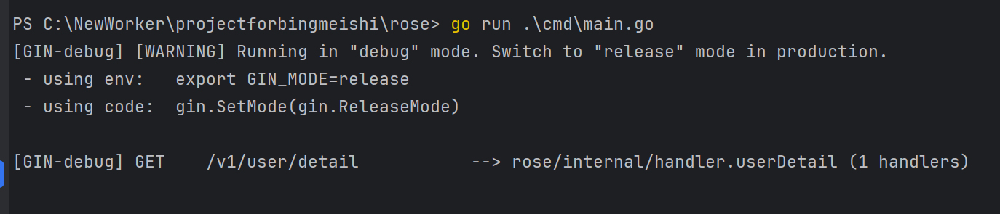

# 1.数据库连接配置解读
## 1.1 字段解读
YAML配置片段中，每个字段都是数据库连接配置的一部分，通常用于配置Go程序中的数据库连接池。这里的配置通常用于指定如何连接到数据库，以及管理数据库连接的行为。以下是每个字段的具体解释：
### `db`:
这是一个顶级键（key），所有数据库相关的配置都包含在这个块中。

### `dsn`:
- **键名**: `dsn`
- **值**: `"root:123456@tcp(127.0.0.1:3306)/rose?parseTime=true"`
- **解释**:
    - `dsn` 代表 "Data Source Name"，即数据源名称，是一个字符串，包含了数据库的连接信息。
    - `root`: 数据库登录用户名，新创建的MySQL数据库默认就是这个用户名。
    - `123456`: 数据库登录密码。
    - `tcp(127.0.0.1:3306)`: 使用TCP/IP协议连接到数据库服务器，其中 `127.0.0.1` 是数据库服务器的IP地址（这里是本机地址），`3306` 是MySQL数据库的默认端口。
    - `/rose`: 要连接的数据库名称。
    - `parseTime=true`: 这是一个连接参数，告诉驱动程序将MySQL中的日期和时间类型（如DATETIME、TIMESTAMP）转换为Go的`time.Time`类型。

### `active`:
- **键名**: `active`
- **值**: `10`
- **解释**:
    - 表示数据库连接池中允许的最大活动（打开）连接数。这个数字限制了同时能够从连接池中借出的活跃连接数量。

### `idle`:
- **键名**: `idle`
- **值**: `10`
- **解释**:
    - 控制连接池中保持空闲状态的连接数。即使使用量减少，这些连接也不会被关闭。这有助于保持一定数量的立即可用连接，从而提高应用性能。

### `idleTimeout`:
- **键名**: `idleTimeout`
- **值**: `60s`
- **解释**:
    - 空闲连接在连接池中保持打开状态的最大时长。设置为60秒，意味着如果连接60秒内没有被使用，则会被关闭，从而释放资源。

这样的配置有助于合理管理数据库资源，避免过多的连接消耗过多资源，同时保证在应用需要时能够快速响应数据库请求。这些设置特别适合处理具有变化数据库负载的应用程序。
## 1.2 数据库连接池的概念
数据库连接池是一种数据库连接管理技术，旨在减少频繁打开和关闭数据库连接所带来的性能开销。连接池预先创建并维护一组连接，这些连接可以被多个应用程序或多个组件重复使用，而不是每次操作都建立新的连接。这种方式大大提高了资源利用率，减少了延迟，并提升了应用程序的响应速度。

`主要特点和优势`:
1. 性能优化：
   连接池通过重用现有的连接，减少了频繁建立和销毁连接的开销。这对于需要频繁访问数据库的应用程序来说，可以显著提高效率和性能。

2. 资源管理：
   连接池允许系统管理员控制最大并发数据库连接数，避免过多的连接数过载数据库服务器。这有助于合理分配系统资源，避免因过多并发连接而导致的系统崩溃。

3. 更快的连接响应：
   由于连接已经预先创建并维护在池中，应用程序请求数据库连接时可以快速获取，不需要等待连接被创建。

4. 管理简便：
   连接池提供了集中管理连接的方式，开发人员可以不用关注连接的打开和关闭，只需要从池中获取或返回连接即可。同时，许多连接池提供了高级功能，如连接健康检查、自动恢复坏连接、连接泄露检测等。

`工作原理`:

当应用程序启动时，连接池根据配置参数创建一定数量的数据库连接，并将这些连接保存在池中。当应用程序需要访问数据库时，它会从连接池中借用一个连接，而不是直接打开一个新的连接。应用程序使用完毕后，会将连接归还到池中而不是关闭它。

如果所有连接都在使用中，连接池可以选择等待某个连接被释放，或者根据配置策略创建额外的连接。同样，如果空闲连接过多，连接池可能会关闭一些不再需要的连接以节约资源。

`配置参数`:

连接池的配置通常包括以下几个关键参数：

- 最大连接数（max active）：允许的最大连接总数。
- 最大空闲连接数（max idle）：池中可以保持空闲状态的最大连接数。
- 最小空闲连接数（min idle）：池中应始终保持的最小空闲连接数。
- 初始化连接数（initial size）：启动时池中初始的连接数量。
- 最大等待时间（max wait time）：在抛出异常前，池在没有可用连接时应等待的最长时间。
- 空闲连接超时（idle timeout）：一个连接在被关闭前可以保持空闲状态的最长时间。

# 2.server配置解读
## 2.1 字段解读
当前YAML配置段是用于设置服务器网络参数的。这里的每个字段都定义了服务器在网络通信方面的具体行为和约束。
### `server`:
这是顶层键，用于将以下所有的配置项组织在一个网络服务配置的上下文中。

### `network`:
- **键名**: `network`
- **值**: `"tcp"`
- **解释**: 这个字段指定了服务器通信使用的网络协议。在这个例子中，它设置为`"tcp"`，表明服务器使用TCP协议进行通信。TCP（传输控制协议）是最常用的网络协议之一，提供可靠的、面向连接的通信。

### `address`:
- **键名**: `address`
- **值**: `":8080"`
- **解释**: 这个字段定义了服务器监听的地址和端口号。在这个例子中，`":8080"`表示服务器将在本机的8080端口上监听所有入站连接请求。冒号前面没有指定具体的IP地址，这意味着服务器将接受连接到此主机上的任何IP地址的请求。

### `readTimeout`:
- **键名**: `readTimeout`
- **值**: `10s`
- **解释**: 这个字段设置了服务器读操作的超时时间。`10s`表示如果服务器在10秒内没有从客户端成功读取数据，当前的操作将被中断并返回超时错误。这有助于避免服务器在等待来自缓慢或不响应的客户端时无限期地挂起。

`Q1:为什么这里一直在等待，没有超时返回错误？好像是程序中没有用到这个字段？？？`
```
PS C:\NewWorker\projectforbingmeishi\rose> go run .\cmd\main.go
[GIN-debug] [WARNING] Running in "debug" mode. Switch to "release" mode in production.
 - using env:   export GIN_MODE=release
 - using code:  gin.SetMode(gin.ReleaseMode)

[GIN-debug] GET    /v1/user/detail           --> rose/internal/handler.userDetail (1 handlers)
```


### `writeTimeout`:
- **键名**: `writeTimeout`
- **值**: `10s`
- **解释**: 类似于`readTimeout`，这个字段设置了服务器写操作的超时时间。`10s`表示如果服务器在10秒内不能向客户端成功发送数据，当前的操作将被中断并返回超时错误。这同样有助于防止服务器在尝试写入到一个缓慢或断开的连接时发生阻塞。

### 总结
这些配置项共同定义了一个网络服务的基本运行参数，包括它如何通过网络与客户端通信、在何处接收请求、以及如何管理潜在的网络延迟或中断。这样的设置有助于确保服务能够高效可靠地运行，并且能够适当地管理网络资源和异常情况。正确配置这些参数对于维护服务的性能和用户体验至关重要。